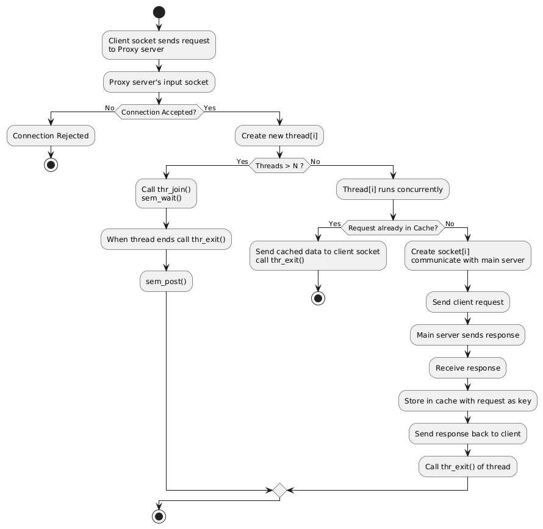

# Multi-Method HTTP Proxy Server with Caching

A high-performance, multithreaded HTTP proxy server written in C that supports all major HTTP methods (GET, POST, PUT, PATCH, DELETE) with intelligent caching and custom request parsing.

## Features

- **Multi-Method Support**: GET, POST, PUT, PATCH, DELETE
- **Smart Caching**: LRU cache for GET requests only (safe to cache)
- **Custom HTTP Parser**: No dependency on restrictive third-party libraries
- **Multithreaded**: Concurrent client handling with thread pool management
- **Request Body Handling**: Proper forwarding of POST/PUT/PATCH request bodies
- **Thread-Safe**: Mutex-protected cache operations
- **Memory Efficient**: Automatic cache size management and cleanup
- **Error Handling**: Comprehensive HTTP error responses

## Architecture Overview



## Technical Specifications

### Core Components

| Component | Description |
|-----------|-------------|
| **HTTP Parser** | Custom parser supporting all HTTP methods |
| **Cache System** | LRU cache with configurable size limits |
| **Thread Pool** | Semaphore-controlled concurrent connections |
| **Memory Management** | Automatic cleanup and leak prevention |

### Supported HTTP Methods

- **GET** - Retrieve data (cacheable)
- **POST** - Create new resources
- **PUT** - Update/replace resources
- **PATCH** - Partial updates
- **DELETE** - Remove resources

## Installation & Compilation

### Prerequisites

- GCC compiler
- POSIX-compliant system (Linux, macOS, Unix)
- pthread library

### Build Instructions

```bash
# Clone or download the source files
git clone <repository-url>
cd MTPSC

# Compile using Makefile
make all

# Or compile manually
gcc -g -Wall -c proxy_parse.c
gcc -g -Wall -c proxy_server_with_cache.c
gcc -g -Wall -o proxy proxy_parse.o proxy.o -lpthread
```

### Clean Build

```bash
make clean
make all
```

## Usage

### Starting the Server

```bash
# Start proxy on port 8000
./proxy 8000

# Expected output:
# Starting Multi-Method Proxy Server at port: 8000
# Supported methods: GET, POST, PUT, PATCH, DELETE
# Proxy server listening on port 8000...
```

### Client Configuration

Configure your HTTP client to use the proxy:

**cURL:**
```bash
curl -x localhost:8000 http://example.com
```

**Browser (Firefox/Chrome):**
- Manual Proxy Configuration
- HTTP Proxy: `localhost`
- Port: `8000`

## Testing & Examples

### GET Request (Cacheable)

```bash
# First request (cache miss)
curl -x localhost:8000 http://httpbin.org/get

# Second request (cache hit - faster)
curl -x localhost:8000 http://httpbin.org/get
```

**Expected Server Output:**
```
Method: GET, Host: httpbin.org, Path: /get, Content-Length: 0
Response cached successfully (891 bytes)
Added to cache: GET http://httpbin.org/get (891 bytes)

# Second request:
URL found in cache for method GET
Data retrieved from cache
```

### POST Request with JSON Body

```bash
curl -x localhost:8000 -X POST \
  -H "Content-Type: application/json" \
  -d '{"name":"Alice","age":25}' \
  http://httpbin.org/post
```

**Expected Server Output:**
```
Method: POST, Host: httpbin.org, Path: /post, Content-Length: 25
Forwarding request body (25 bytes) for method: POST
```

### PUT Request

```bash
curl -x localhost:8000 -X PUT \
  -H "Content-Type: application/json" \
  -d '{"id":1,"name":"Updated Alice","age":26}' \
  http://httpbin.org/put
```

### PATCH Request

```bash
curl -x localhost:8000 -X PATCH \
  -H "Content-Type: application/json" \
  -d '{"age":27}' \
  http://httpbin.org/patch
```

### DELETE Request

```bash
curl -x localhost:8000 -X DELETE http://httpbin.org/delete
```

## Performance Features

### Intelligent Caching

- **Only GET requests are cached** (safe for caching)
- **LRU eviction policy** removes least recently used entries
- **Thread-safe operations** with mutex protection
- **Configurable size limits** prevent memory exhaustion

### Multi-threading

- **Concurrent client handling** up to MAX_CLIENTS
- **Semaphore-controlled** thread pool
- **Per-thread request processing**
- **Automatic resource cleanup**

### Demo

(Docs/curl1.png)
(Docs/curl2.png)
(Docs/browser.png)

### Memory Management

- **Automatic cache size management**
- **Proper memory deallocation**
- **Buffer overflow prevention**
- **Memory leak prevention**

## Error Handling

The proxy returns appropriate HTTP status codes:

| Status Code | Description | Cause |
|-------------|-------------|-------|
| 400 Bad Request | Invalid HTTP request format | Malformed request |
| 501 Not Implemented | Unsupported HTTP method | Methods other than GET/POST/PUT/PATCH/DELETE |
| 500 Internal Server Error | Server-side error | Connection failures, memory issues |

## Limitations

- **No HTTPS support** - Only HTTP proxying (no CONNECT method)
- **No HTTP/2 support** - HTTP/1.0 and HTTP/1.1 only  
- **No WebSocket support** - Standard HTTP requests only
- **No authentication** - Open proxy (suitable for development/testing)
- **IPv4 only** - No IPv6 support

## Debugging & Troubleshooting

### Common Issues

**Connection Refused:**
```bash
# Check if server is running
netstat -tlnp | grep 8000

# Verify port availability
lsof -i :8000
```

**Memory Issues:**
```bash
# Monitor memory usage
ps aux | grep proxy

# Check for memory leaks (if valgrind is available)
valgrind --leak-check=full ./proxy 8000
```

### Verbose Logging

The server provides detailed logging:
- Client connection/disconnection
- Request parsing details
- Cache hit/miss statistics
- Error conditions
- Thread management

### Testing Script

```bash
#!/bin/bash
# Comprehensive test script

echo "Testing GET request..."
curl -s -x localhost:8000 http://httpbin.org/get > /dev/null
echo "✓ GET test passed"

echo "Testing POST request..."
curl -s -x localhost:8000 -X POST -d '{"test":true}' -H "Content-Type: application/json" http://httpbin.org/post > /dev/null
echo "✓ POST test passed"

echo "Testing cache functionality..."
time curl -s -x localhost:8000 http://httpbin.org/get > /dev/null
time curl -s -x localhost:8000 http://httpbin.org/get > /dev/null
echo "✓ Cache test passed (second request should be faster)"

echo "All tests completed successfully!"
```

## Development & Contribution

### Code Structure

- **proxy.c** - Main server logic, thread management, request handling
- **proxy_parse.h** - HTTP parser interface definitions
- **proxy_parse.c** - Custom HTTP parser implementation

### Key Functions

```c
// Main server functions
int connectRemoteServer(char* host_addr, int port_num);
int handle_request(int clientSocket, ParsedRequest *request, char *original_request);
void *thread_fn(void *socketNew);

// HTTP parser functions
ParsedRequest* ParsedRequest_create();
int ParsedRequest_parse(ParsedRequest* pr, const char* buffer, int buflen);
int ParsedHeader_set(ParsedRequest* pr, const char* name, const char* value);

// Cache functions
cache_element* find(char* url, char* method);
int add_cache_element(char* data, int size, char* url, char* method);
void remove_cache_element();
```

### Extending Functionality

-This code can be implemented using multiprocessing that can speed up the process with parallelism.

-We can decide which type of websites should be allowed by extending the code.

To add new HTTP methods:
1. Update `is_supported_method()` in proxy.c
2. Update `is_valid_method()` in proxy_parse.c
3. Consider caching policy in `should_cache()`

## License

This project is licensed under the MIT License - see the [LICENSE](LICENSE) file for details.

MIT License

Copyright (c) 2024 Soumalya Karak

Permission is hereby granted, free of charge, to any person obtaining a copy
of this software and associated documentation files (the "Software")...

## Acknowledgments

- Built using POSIX sockets and threading
- HTTP parsing follows RFC 7230 specifications
- Cache implementation uses LRU (Least Recently Used) algorithm

---

**Note**: This code can only be run in Linux Machine.If you want browsers to work with HTTPS sites, you'd need to implement basic CONNECT method tunneling.